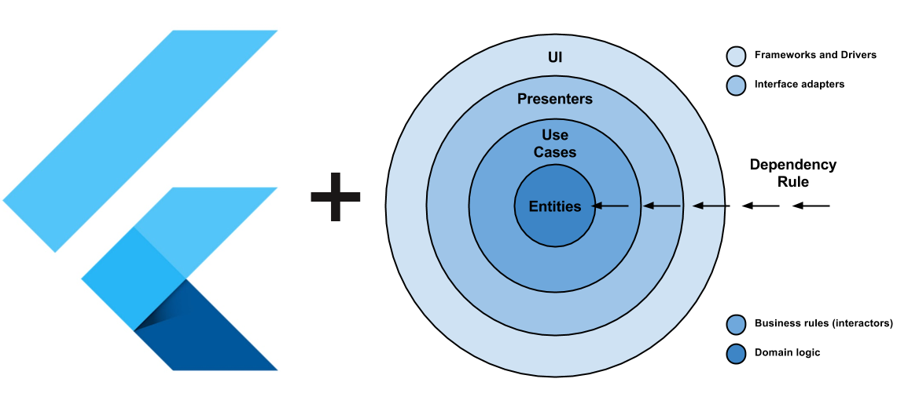

# Здарово!
Спасибо, что решили податься на позицию flutter разработчика!
Это тестовое задание, которое поможет определить ваш уровень быстро и без вращения деревьев в блоконте. 
Мы вытащили кусочек из давно завершенного приложения, необходимо его доделать и сдать его через неделю.

## Getting Started

Установите все зависимости из pubspec можно стандартной командой

```shell
flutter pub get
```

## TODO

### Что нужно сделать:
Убедитесь, что приложение загружается, отрисовывает страницу загрузки и главную страницу
Реализовать две страницы:
* Список врачей `lib/src/features/therapist`
  1. Получение данных с апи.
  2. Отрисовку списка карточек врачей: аватар, имя, цену услуг.
  3. Фильтр списка: возраст и цена.
  4. Слайдер
* Страницу врача
  1. Header: аватар, имя, кнопка перехода к списку врачей
  2. Блок со случайно сгенерированной информацией (просто текст) на 255 символов.

### Примечание:

  1. Используйте библиотеку [bloc](https://bloclibrary.dev/#/) в качестве стэйт менеджера
  2. Старайтесь разделять код на слои:
data - слой работы с данными, храните тут свои moc данные.
domain - слой бизнес-логики.
internal - слой приложения. На этом уровне происходит внедрение зависимостей.
presentation - слой представления. На этом уровне описываем UI.
  https://habr.com/ru/articles/522640/
  
   3. Попробуйте добавить анимацию
