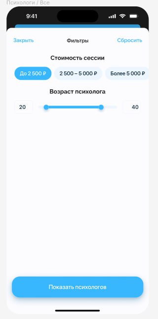
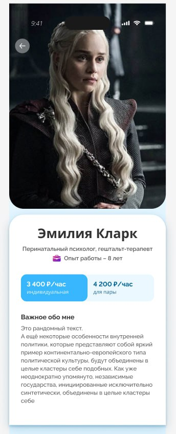

# Здарово!
Спасибо, что решили податься на позицию flutter разработчика!
Это тестовое задание, которое поможет определить ваш уровень быстро и без вращения деревьев в блоконте.
Используйте этот boilerplate project или создайте сами с библиотекой Block.

## Getting Started
Установите все зависимости из pubspec можно стандартной командой

```shell
flutter pub get
```

Сгегенируйте зависимости и переводы

```shell
flutter pub run intl_utils:generate
```

Соберите проект
```shell
flutter pub run build_runner build --delete-conflicting-outputs
```

## TODO

### Что нужно сделать:
[figma](https://www.figma.com/file/hfV8YVw7uWNEb1lHdbPFNX/Untitled?type=design&node-id=0%3A1&mode=design&t=ARFhMydSbNRwzMJn-1)
Убедитесь, что приложение загружается, рисует страницу загрузки. 

Добавьте недостающие поля в модели, добавьте необходимую реализацию с пометкой @TODO.

#### Реализовать две страницы:



* Список врачей `lib/src/features/therapist`
    1. Вместо получения данных с апи создайте массив моделей.
    2. Сделайте список карточек врачей: аватар, имя, цену услуг. Писать цену "от", если цена групповой и пары отличается.
    3. Сделайте список фильтр списка: по возрасту и цене.


* Страницу врача
    1. Header: аватар, имя, кнопка перехода обратно к списку врачей.
    2. Блок со случайно сгенерированной информацией (просто текст) до 255 символов.
    3. Блок выбор цены (индивидуальная и пара).

### Примечание:
1. Используйте библиотеку [bloc](https://bloclibrary.dev/#/) в качестве стэйт менеджера.
2. Попробуйте добавить анимацию.
3. Старайтесь разделять код на слои.
4. Рекомендуем использовать уже добавленные в этот проект компоненты и цветовые схемы
5. Текст лучше заводить через переводы
6. Слайдер возраста с 18 до 70 лет.
7. Цена у терапевта из двух полей: индивидуальная и групповая.


Возможное разделение на слои:
data - слой работы с данными, храните тут свои moc данные.
domain - слой бизнес-логики.
internal - слой приложения. На этом уровне происходит внедрение зависимостей.
presentation - слой представления. На этом уровне описываем UI.
https://habr.com/ru/articles/522640/

   
Если у вас появились вопросы где взять какие-то файлы (тексты, иконки, картинки) или как правильно организовать "X" - пишите.
